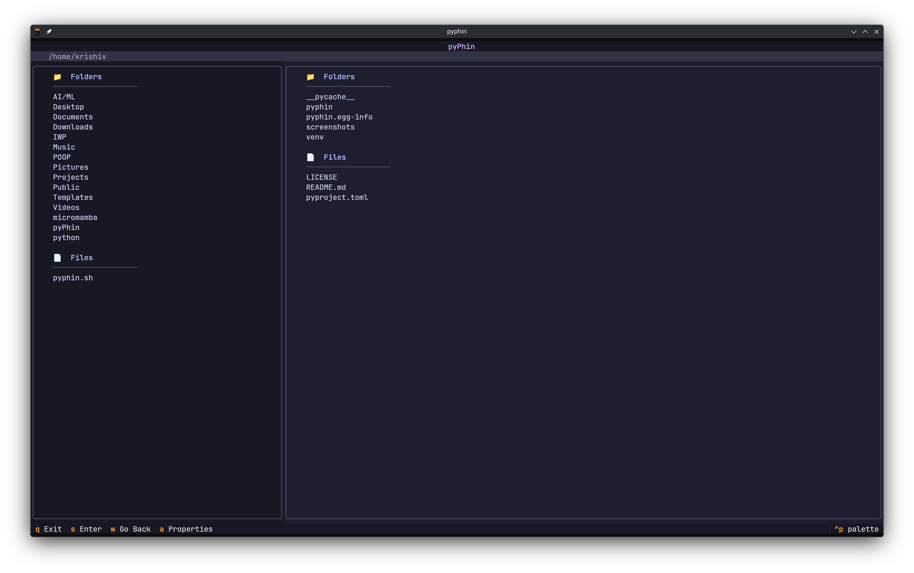
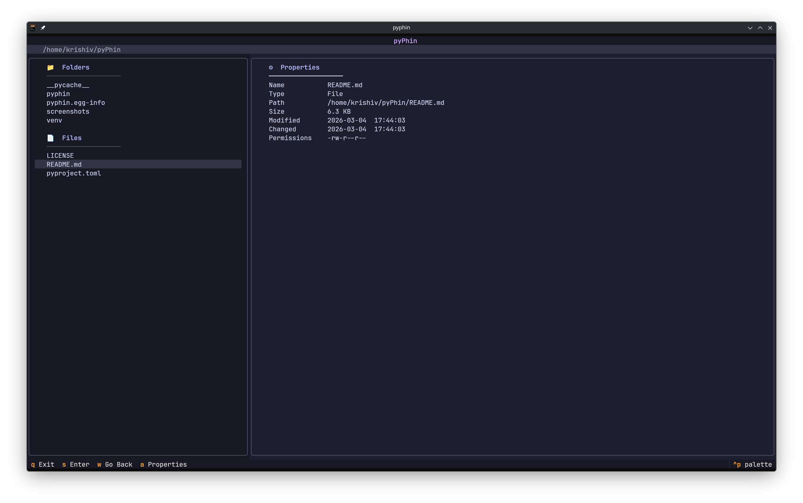

<div align="center">

```
██████╗ ██╗   ██╗██████╗ ██╗  ██╗██╗███╗   ██╗
██╔══██╗╚██╗ ██╔╝██╔══██╗██║  ██║██║████╗  ██║
██████╔╝ ╚████╔╝ ██████╔╝███████║██║██╔██╗ ██║
██╔═══╝   ╚██╔╝  ██╔═══╝ ██╔══██║██║██║╚██╗██║
██║        ██║   ██║     ██║  ██║██║██║ ╚████║
╚═╝        ╚═╝   ╚═╝     ╚═╝  ╚═╝╚═╝╚═╝  ╚═══╝
```

**A minimal, keyboard-driven file explorer for the terminal.**  
*Built with Python and Textual — fast, clean, no bloat.*


</div>

---

## What is pyPhin?

pyPhin is a terminal-based file explorer built with Python. It follows the philosophy that a file manager should stay out of your way — no mouse required, no heavy dependencies, just keyboard bindings and a clean two-panel layout. The left panel shows the current directory and the right panel previews whatever is highlighted, giving you instant context as you move through your filesystem.

It is designed to be readable as a codebase too — a learning project that doesn't hide complexity behind abstractions, making it easy to extend and modify.

---

## Screenshots


| Main View | Properties Panel |
|-----------|-----------------|
|  |  |

---

## Features

- **Two-panel layout** — directory tree on the left, live preview on the right
- **Instant preview** — right panel updates as you highlight items, powered by background worker threads so the UI never freezes
- **File metadata** — press `a` to inspect any file or folder: size, path, permissions, timestamps
- **Recursive folder size** — actual disk usage calculated for directories, not just the entry size
- **Permission display** — Unix-style permission strings (`drwxr-xr-x`) for every entry
- **Keyboard-first** — everything reachable without touching the mouse
- **Error handling** — permission denied, unreadable directories, and empty folders are all handled gracefully
- **Hidden file filtering** — dotfiles are hidden by default, keeping the view clean
- **Capped directory reads** — limits entries to 1000 per folder to keep I/O fast even in massive directories

---

## Keybindings

| Key | Action |
|-----|--------|
| `s` | Enter highlighted directory |
| `w` | Go up to parent directory |
| `a` | Show file / folder properties |
| `q` | Quit |

---

## Installation

### Prerequisites

- Python 3.10 or higher
- `pip`

### From source

```bash
# 1. Clone the repository
git clone https://github.com/krishiv2489/pyPhin.git
cd pyPhin

# 2. Create and activate a virtual environment (recommended)
python -m venv .venv
source .venv/bin/activate

# 3. Install in editable mode
pip install -e .

# 4. Run
pyphin
```

### Without a virtual environment

```bash
git clone https://github.com/krishiv2489/pyPhin.git
cd pyPhin
pip install . --break-system-packages
pyphin
```

---

## Project Structure

```
pyPhin/
├── pyphin/
│   ├── __init__.py       # Package init
│   ├── main.py           # Textual app, UI logic, keybindings
│   ├── pyath.py          # Backend: path traversal, metadata, filesystem ops
│   └── file.tcss         # Textual CSS — layout and styling
├── pyproject.toml        # Build config and entry point
└── README.md
```

The project is intentionally split into two layers. `pyath.py` is pure filesystem logic with no UI knowledge — it can be tested or run in isolation. `main.py` is pure UI that calls into `pyath.py` and never does filesystem work directly. Keeping these two concerns separate is what makes the codebase easy to extend.

---

## How It Works

pyPhin uses **Textual worker threads** to keep the UI responsive. When you navigate into a folder or request metadata, the work is dispatched to a background thread via `@work(thread=True)`. The result is sent back to the main thread through Textual's `Worker.StateChanged` event, which then updates the panel. This means a slow filesystem or a large directory will never cause the interface to freeze or drop inputs.

The backend uses only Python's standard library — `pathlib` for cross-platform path handling, `stat` for permission formatting, and `datetime` for human-readable timestamps. No third-party filesystem libraries.

---

## Roadmap

These are features planned or under consideration:

- [ ] File preview — render the first N lines of text files in the right panel
- [ ] Hidden file toggle — press `h` to show/hide dotfiles
- [ ] Search and filter — filter the left panel by filename in real time
- [ ] Bookmarks — save and jump to favourite paths
- [ ] Sort modes — cycle between name, size, and modified date ordering
- [ ] Rename and delete — with a confirmation modal
- [ ] Windows support — abstract the home path detection for cross-platform use

---

## Contributing

Contributions are welcome. If you have a bug fix, feature idea, or improvement to the code structure, feel free to open an issue or a pull request.

1. Fork the repository
2. Create a feature branch: `git checkout -b feature/your-feature`
3. Commit your changes: `git commit -m "Add your feature"`
4. Push and open a pull request

Please keep the two-layer architecture intact — filesystem logic stays in `pyath.py`, UI logic stays in `main.py`.

---

## Author

**Krishiv Patel**  
GitHub: [@krishiv2489](https://github.com/krishiv2489)

---

## License

This project is licensed under the MIT License. You are free to use, modify, and distribute it.

---

<div align="center">
<sub>Built with Python · Powered by Textual · Made for the terminal</sub>
</div>
